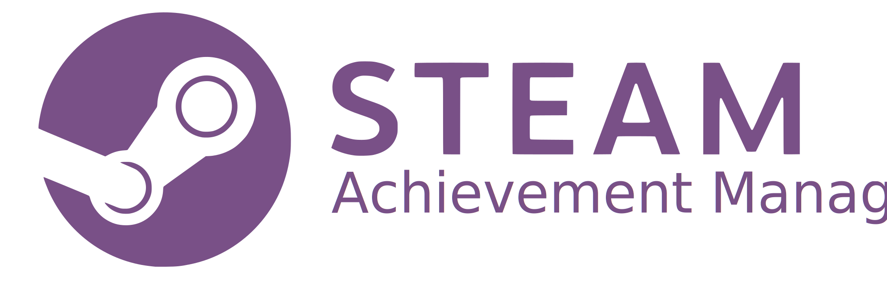
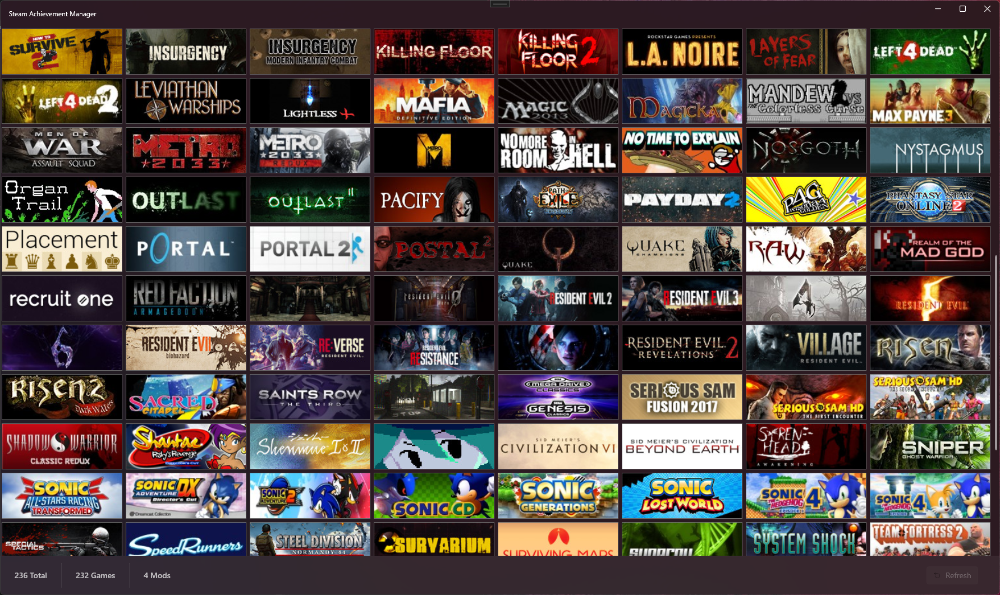

<h1>
  

    
    
    
    
    
  

</h1>

  

## Overview

The Steam Achievement Manager lets you manage achievements, stats, and more for any currently supported Steam app.

  

This project is an actively updated fork of the [Steam Achievement Manager](https://github.com/gibbed/SteamAchievementManager).

## Project Structure

**SAM** is comprised of five projects.

`SAM` and `SAM.Console` (_WIP_) are the two application projects that create an executable. `SAM` is the executable that will display your Steam library and let you select an app (game) to manage. When managing a game, the app ID is passed as an argument to `SAM.exe` and it initializes the Steam API client with that AppID the same way that normal games would. Steam will show you as in-game, record your play time, and you can earn trading cards (assuming of course you have drops left).

Both `SAM.API` and `SAM.Core` are libraries (`*.dll`). As its name suggests, `SAM.API` contains the native Steam API wrappers. `SAM.Core` is referenced by both executable projects (more on these later) and allows them to both use the same types, resources, etc. without having to duplicate code.

<table align="center">
    <tr>
        <th align="center">Legacy Project</th>
        <th align="center">New Project</th>
        <th style="width: 80%;">Description</th>
    </tr>
    <tr>
        <td align="center"><b>SAM.Picker</b></td>
        <td align="center"><b>SAM</b></td>
        <td>The main executable used to select a game (or app) from your library</td>
    </tr>
    <tr>
        <td align="center">-</th>
        <td align="center"><b>SAM.Console</b></td>
        <td>Command line interface for SAM for use with console, automation, etc. <i>This is still in development and will be released in a future version.</i></td>
    </tr>
    <tr>
        <td align="center"><b>SAM.Game</b></td>
        <td align="center"><b>SAM</b></td>
        <td>Allows for viewing and editing an app's achievements and stats</td>
    </tr>
    <tr>
        <td align="center"><b>SAM.API</b></td>
        <td align="center"><b>SAM.API</b></td>
        <td>Managed Steam API wrappers</td>
    </tr>
    <tr>
        <td align="center">-</th>
        <td align="center"><b>SAM.Core</b></td>
        <td>Common resources used by both <code>SAM</code> and <code>SAM.Console</code>.</td>
    </tr>
</table>

## Sponsors

  

A special thank you to [JetBrains](https://www.jetbrains.com/) for their continued [Support of Open-Source Projects](https://www.jetbrains.com/community/opensource/#support) like **SAM**.

> [!NOTE]
> Active **SAM** contributors are eligible to receieve complimentary licenses [^1] for **all** **JetBrains** products. For questions regarding eligability please refer to the [Open Source FAQ](https://sales.jetbrains.com/hc/en-gb/categories/13706169183250-Free-Licenses-for-OSS-development).

## Acknowledgements

  <a href="https://github.com/DevExpress/DevExpress.Mvvm.Free">DevExpress</a> • <a href="https://github.com/RudeySH/SteamCountries">SteamCountries</a> • <a href="https://github.com/lepoco/wpfui">WPF UI</a>

[^1]: For non-commercial development
