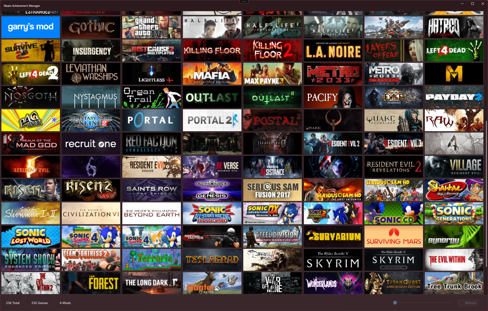

  
  
  

  

## Overview

The Steam Achievement Manager lets you manage achievements, stats, and more for any currently supported app.

  

This project is a fork of the [Steam Achievement Manager](https://github.com/gibbed/SteamAchievementManager) project with the goal of updating to .NET Core and WPF. This is very much a work in progress.

## Project Structure

**SAM** is comprised of five projects.

`SAM` and `SAM.Manager` are the two application projects that create an executable. `SAM` is the executable that will display your Steam library and let you select an app (game) to manage. When the manager is started, it's passed an ID for a Steam app after which it initializes the Steam API client with that AppID just like any game on Steam would. Steam will show you as in-game, record your play time, and you can earn trading cards (if you have drops left).

The reason why there's two executables is because the manager (`SAM.Manager`) needs to be in its own process anyways in order to actually manage the achievements and stats. Once a process is registered with the Steam client it's not possible to re-initialize the Client with a different AppID. Steam will also treat you as in-game until that Process and any child Processes have exited.

Both `SAM.API` and `SAM.Core` are libraries (`*.dll`). As its name suggests, `SAM.API` contains the native Steam API wrappers. `SAM.Core` is referenced by both executable projects (more on these later) and allows them to both use the same types, resources, etc. without having to duplicate code.

<table align="center">
    <tr>
        <th align="center">Legacy Project</th>
        <th>New Project</th>
        <th style="width: 80%;">Description</th>
    </tr>
    <tr>
        <td align="center"><b>SAM.Picker</b></td>
        <td align="center"><b>SAM</b></td>
        <td>The main executable used to select a game (or app) from your library</td>
    </tr>
    <tr>
        <td align="center"><b>SAM.Game</b></td>
        <td align="center"><b>SAM.Manager</b></td>
        <td>Allows for viewing and editing an app's achievements and stats</td>
    </tr>
    <tr>
        <td align="center"><b>SAM.API</b></td>
        <td align="center"><b>SAM.API</b></td>
        <td>Managed Steam API wrappers</td>
    </tr>
    <tr>
        <td align="center">-</th>
        <td align="center"><b>SAM.Core</b></td>
        <td>Common resources used by both <code>SAM</code> and <code>SAM.Manager</code>.</td>
    </tr>
</table>

---

## FAQ

### What is an App or App ID?

> An Application (or App) is the main representation of a product on Steam. An App generally has its own store page, it's own Community Hub, and is what appears in customers' libraries. Each App is represented by a unique ID called an App ID - that you'll see referenced throughout this documentation and used with the Steamworks API and Steamworks Web API. Generally a single product will not span multiple Applications. ([source](https://partner.steamgames.com/doc/store/application))

### Why does SAM let people cheat achievements?

Some games have achievements that are no longer reasonably or actually attainable. While SAM _can_ be used to abuse the achievement system, it also lets people who do care about achievements unlock achievements that would otherwise be impossible. One common example is achievements requiring you to play multiplayer on a game that no longer has any active players, or even dedicated servers. **SAM** is a potential solution for a game's poorly designed achievements.

---

## Acknowledgements

- [Devexpress MVVM](https://github.com/DevExpress/DevExpress.Mvvm.Free)
- [Font-Awesome-WPF](https://github.com/charri/Font-Awesome-WPF)
- [SteamCountries](https://github.com/RudeySH/SteamCountries)
- [WPF UI](https://github.com/lepoco/wpfui)

---

## Resources

- [DevExpress MVVM](https://docs.devexpress.com/WPF/15112/mvvm-framework)
- [Font-Awesome-WPF Documentation](https://github.com/charri/Font-Awesome-WPF/blob/master/README-WPF.md)
- [Steamworks API Overview](https://partner.steamgames.com/doc/sdk/api)
  - [Steamworks API](https://partner.steamgames.com/doc/api)
  - [Steamworks Web API](https://partner.steamgames.com/doc/webapi)
